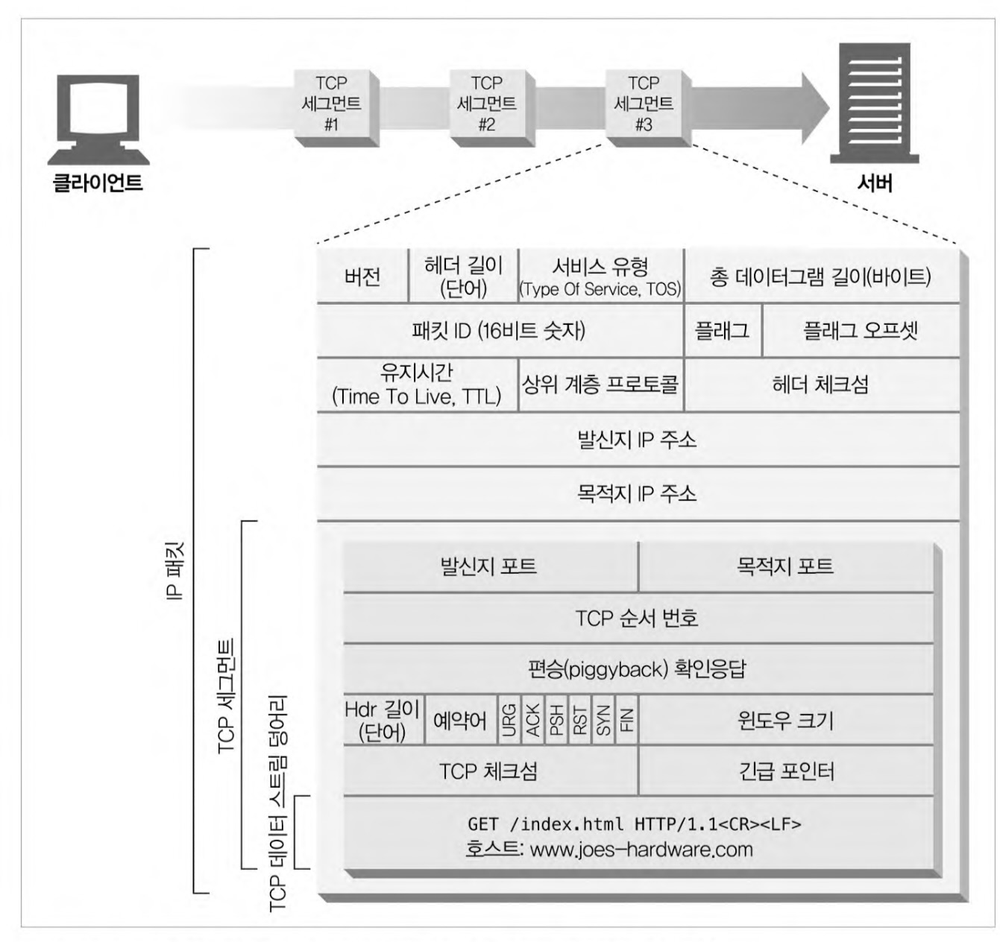
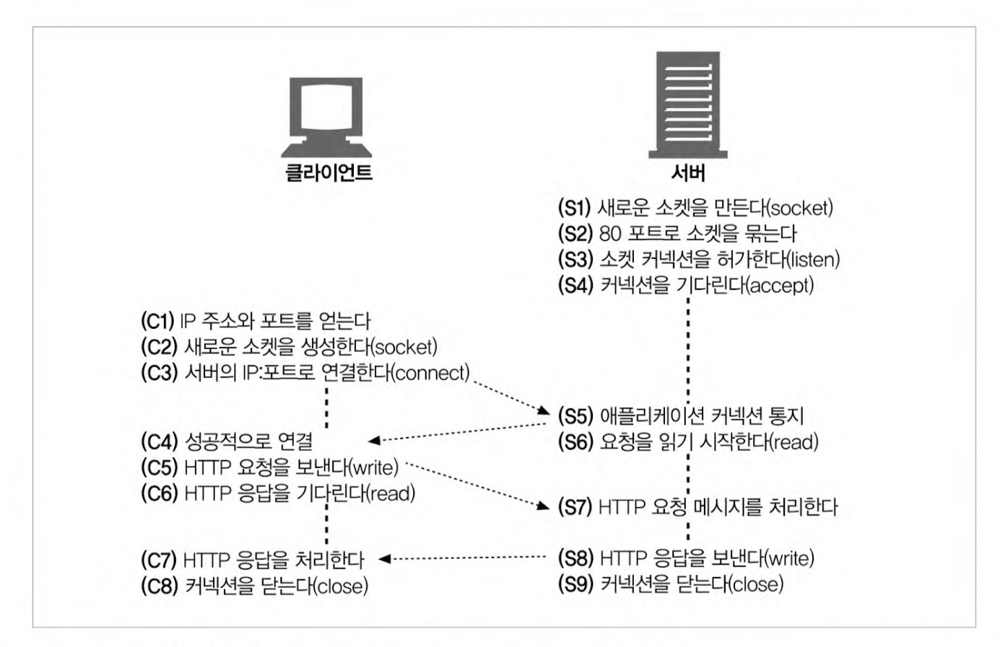

# 커넥션 관리

-   HTTP는 어떻게 TCP 커넥션을 사용하는가
-   TCP 커넥션의 지연, 병목, 막힘
-   병렬 커넥션, kepp-alive 커넥션, 커넥션 파이프라인을 활용한 HTTP의 최적화
-   커넥션 관리를 위해 따라야 할 규칙들

## TCP 커넥션

지구상의 모든 클라이언트와 서버 애플리케이션은 TCP/IP 커넥션을 맺을 수 있다. 커넥션이 맺어지면 서로 주고받는 메시지는 손실, 손상 없이 그리고 순서가 바뀌지 않고 안전하게 전달된다.

**커넥션 수행 단계**

요청 주소: http://www.joes-hardware.com:80/power-tools.html

1. 브라우저가 www.joes-hardware.com라는 호스트명을 추출한다.
2. 브라우저가 이 호스트명에 대한 IP 주소를 찾는다.
3. 브라우저가 포트 번호를 얻는다.
4. 브라우저가 얻은 IP:PORT 로 TCP 커넥션을 생성한다.
5. 브라우저가 서버로 HTTP GET 요청 메시지를 보낸다.
6. 브라우저가 서버에서 온 HTTP 응답 메시지를 읽는다.
7. 브라우저가 커넥션을 끊는다.

### TCP 스트림은 세그먼트로 나뉘어 IP 패킷을 통해 전송된다.

HTTP가 메시지를 전송하고자 할 경우, 현재 연결되어 있는 TCP 커넥션을 통해서 메시지 데이터를 순서대로 보낸다. 이때 TCP는 세그먼트라는 단위로 데이터 스트림을 잘게 나누고 세그먼트를 IP 패킷에 담아서 인터넷을 통해 데이터를 전달한다. 이 모든 과정이 TCP/IP 소프트웨어에 의해 처리된다. 따라서 이 과정은 HTTP 프로그래머에게 보이지 않는다.

여기서 각 IP 패킷은 다음을 포함한다.

-   IP 패킷 헤더(보통 20바이트)
-   TCP 세그먼트 헤더(보통 20바이트)
-   TCP 데이터 조각(0 이상의 바이트)

### TCP 커넥션 유지하기

컴퓨터는 항상 TCP 커넥션을 여러 개 가지고 있는데 포트 번호를 통해서 여러 개의 커넥션을 유지한다. 여기서 커넥션은 <발신지 IP, 발신지 포트, 수신지 IP, 수신지 포트>로 유일한 커넥션으로 구성된다. 구성요소가 모두 동일한 커넥션은 존재할 수 없다.(일부는 똑같을 수 있다.)

### TCP 소켓 프로그래밍

운영체제는 TCP 커넥션의 생성과 관련된 여러 기능을 제공한다. 아래는 소켓 API의 주요 인터페이스다.

| 소켓 API 호출                | 설명                                                       |
| ---------------------------- | ---------------------------------------------------------- |
| s = socket(<parameters>)     | 연결이 되지 않은 익명의 새로운 소켓 생성                   |
| bind(s, <local IP:port>)     | 소켓에 로컬 포트 번호와 인터페이스 할당                    |
| connect(s, <remote IP:port>) | 로컬의 소켓과 원격의 호스트 및 포트 사이에 TCP 커넥션 생성 |
| listen(s, ...)               | 커넥션을 받아들이기 위해 로컬 소켓에 허용함을 표시         |
| s2 = accept(s)               | 누군가 로컬 포트에 커넥션을 맺기를 기다림                  |
| n = read(s, buffer, n)       | 소켓으로부터 버터에 n바이트 읽기 시도                      |
| n = write(s, buffer, n)      | 소켓으로부터 버터에 n바이트 쓰기 시도                      |
| close(s)                     | TCP 커넥션을 완전히 끊음                                   |
| shutdown(s, <side>)          | TCP 커넥션의 입출력만 닫음                                 |
| getsockopt(s, ...)           | 내부 소켓 설정 옵션값을 읽음                               |
| setsockopt(s, ...)           | 내부 소켓 설정 옵션값을 변경                               |

이러한 소켓 API 구현체 적분에 대부분의 운영체제, 프로그램 언어에서 이를 사용할 수 있게 되었다.

**클라이언트와 서버가 TCP 소켓 인터페이스를 사용하여 상호작용하는 방법**

## HTTP 커넥션 관리
