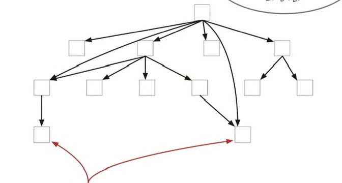
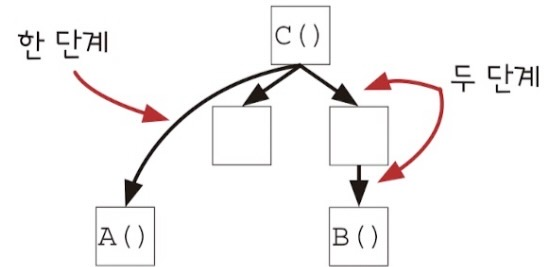

# 계층형 설계 2

계층형 설계 패턴 네 가지 중

-   직접 구현
-   추상화 벽
-   작은 인터페이스
-   편리한 계층

직접 구현은 앞에서 확인했다. 남은 패턴을 확인해보자

## 패턴2 추상화 벽

추상화 벽은 세부 구현을 감춘 함수로 이루어진 계층이다. 추상화 벽에 있는 함수를 사용할 때는 구현을 전혀 몰라도 함수를 사용할 수 있다. 이 추상화 벽이 해결하는 문제중 하나는 팀 간 책임을 명확하게 나눌 수 있다는 것이다.

|           |                       |               |                    |            |                  |
| --------- | --------------------- | ------------- | ------------------ | ---------- | ---------------- |
| 마케팅 팀 | gets_free_shipping()  | cartTax()     |                    |            |                  |
| 추상화 벽 | remove_item_by_name() | calc_total()  | isInCart()         | add_item() | setPriceByName() |
| 개발 팀   | slice()               | indexOfItem() | add_element_last() | arraySet() |

개발 팀에서 추상화 벽을 만들면 마케팅 팀은 반복문이나 배열을 다루지 않고 추상화 벽에 있는 함수를 가져다 사용할 수 있으며 개발 팀은 마케팅 팀이 추상화 벽에 있는 함수를 어떻게 쓰는지 신경 쓰지 않고 일 할 수 있다.

### 장바구니 데이터 구조 바꾸기

개발 팀에서 성능 개선을 위해 장바구니 데이터 구조를 배열에서 해시 맵으로 바꾸기로 했다.

```javascript
function add_item(cart, item) {
    return objectset(cart, item.name);
}

function calc_total(cart) {
    let total = 0;
    const names = Object.keys(cart);

    for (let i = 0; i < names.length; i++) {
        const item = cart[names[i]];
        total += item.price;
    }

    return total;
}

function setPriceByName(cart, name, price) {
    if (isInCart(cart, name)) {
        const item = cart[name];
        const copy = setPrice(item, price);
        return objectSet(cart, name, copy);
    } else {
        const item = make_item(name, price);
        return opjectSet(cart, name, item);
    }
}

function remove_item_by_name(cart, name) {
    return objectDelete(cart, name);
}

function isInCart(cart, name) {
    return cart.hasOwnProperty(name);
}
```

장바구니 데이터 구조를 배열에서 객체로 바꾸어 반복문을 사용할 필요가 없고 더 작고 깔끔하게 만들었다. 이때 데이터 구조를 바꾸기 위해 바꾼 함수들은 모두 추상화 벽에 들어있는 것으로 마케팅 팀이나 다른 팀은 원래 쓰고 있던 코드를 고치지 않고 그대로 써도 아무런 영향이 없다.

### 추상화 벽을 사용하기 좋은 경우

-   **쉽게 구현을 바꾸기 위해**  
     프로토타입 구현이나 이후 바뀔 것으로 예상되는 코드를 쓸때, 임시로 데이터를 만들어서 처리해야 할 때 쓰기 좋다.

-   **코드를 읽고 쓰기 쉽게 만들기 위해**  
     추상화벽을 사용해 구체적이고 세부적인 것을 감추면 다른 것에 신경쓰지 않고 쉽게 생산적인 코드를 만들 수 있다.

-   **팀 간에 조율해야 할 것을 줄이기 위해**  
     이 예시에서 개발팀은 마케팅 팀에게 이야기하지 않고 코드를 고쳤다. 마케팅팀도 개발팀에게 확인할 필요 없이 쉽게 마케팅 코드를 만둘었다. 각 팀 간에 구체적인 내용을 서로 신경 쓰지 않고 빠르게 일 할 수 있다.

## 패턴3 작은 인터페이스

마케팅 팀에서 시계 할인을 하려고 한다. 장바구니 제품 금액 총합이 100달러를 넘고 장바구니에 시계가 있으면 시계를 10% 할인해줘야 한다. 할인 받을 수 있는 사람을 결정하는 코드가 필요하다.

### 시계 할인 마케팅 코드를 구현할 위치

시계 할인 마케팅 코드를 구현할 위치는 두 가지가 있다.

-   **추상화 벽에 만들기**  
     직접 장바구니에 접근할 수 있지만 같은 계층에 있는 함수를 사용할 수 없다.

    ```javascript
    function getsWatchDiscount(cart) {
        let total = 0;
        const names = Object.keys(cart);
        for (let i = 0; i < names.length; i++) {
            const item = cart[names[i]];
            total += item.price;
        }

        return total > 100 && cart.hasOwnProperty("watch");
    }
    ```

-   **추상화 벽 위에 만들기**  
     장바구니에 접근할 수 없기 떄문에 추상화 벽에 있는 함수를 사용해야 한다.
    ```javascript
    function getsWatchDiscount(cart) {
        const total = calcTotal(cart);
        const hasWatch = isInCart("watch");
        return total > 100 && hasWatch;
    }
    ```

결론은 추상화 벽 위에 만드는 것이 더 좋다. 추상화 벽에 만들면 반복문을 사용하고 시스템 하위 계층 코드가 늘어나기 때문이다. 또한 이 코드는 마케팅을 위한 코드이기 때문에 마케팀 팀이 관리해야하고 마케팅 팀은 추상화 벽을 신경쓰지 않아야 하기 떄문에 추상화 벽에 만드는 것보다 그 위에 만든는 것이 더 좋은 것이다.

이처럼 새로운 기능을 만들 때 하위 계층에 추가하거나 고치는 것보다 상위 계층에 만드는 것을 작은 인터페이스 패턴이라고 한다.

### 로그 남기는 코드를 넣을 위치

마케팅 팀은 장바구니에 제품을 담기만 하고 사지는 않는 고객이 있어서 그 이유를 알기 위해 고객이 장바구니에 제품을 담을 때 로그를 남겨달라고 개발팀에게 요청했다.

```javascript
logAddToItem(user_id, item);
```

위 함수는 로그를 남기는 함수다. 이 함수를 어디에 넣어야 할까?

```javascript
function add_item(cart, item) {
    logAddToItem(global_user_id, item);
    return objectSet(cart, item.name, item);
}
```

`add_item` 함수에 넣어봤다. 장바구니에 제품을 넣는 함수에서 로그를 남기는 함수를 호출했으니 문제가 없어보인다. 하지만 이건 결코 좋은 방법이 아니다. 우선 `add_item` 함수는 계산이었다. 하지만 `logAddToItem`함수는 액션이다. 액션을 호출하는 함수 역시 액션이므로 계산이 액션이 되어버렸다! 아래 코드를 보자

```javascript
function update_shipping_icons(cart) {
    const buy_buttons = get_buy_buttons_dom();
    for (let i = 0; i < buy_buttons.length; i++) {
        const button = buy_buttons[i];
        const item = button.item;
        // 여기서도 로그가 남게된다!!
        const new_cart = add_item(cart, item);
        if (gets_free_shipping(new_cart)) {
            button.show_free_shipping_icon();
        } else {
            button.hide_free_shipping_icon();
        }
    }
}
```

위 함수는 무료 배송 여부를 체크하기 위해 `add_item`함수를 호출하지만 실제로 장바구니에 제품을 담지는 않는다. 하지만 `add_item`에서 로그를 남기는 함수를 호출하고 있기 때문에 로그가 남게 된다. 심지어 위 함수는 제품 리스트 DOM을 반복문으로 돌면서 `add_item`을 호출하고 있기 때문에 로그가 엄청 쌓이게 될 것이다. 이러면 테스트가 힘들어지는 것은 둘째 치고 애초에 의도했던 기능과 전혀 다른 기능이 되어버린다. 아래 코드를 보자

```javascript
function add_item_to_cart(name, price) {
    const item = make_cart_item(name, price);
    shopping_cart = add_item(shopping_cart, item);
    const total = calc_total(cart);
    set_cart_total_dom(total);
    update_shipping_icons(cart);
    update_tax_dom(total);
    logAddToItem();
}
```

위 함수는 실제로 제품을 장바구니에 담을 때 호출되는 핸들러 함수이며 이미 액션이다. 이 함수는 사용자가 제품을 장바구니에 담을 때 해야 할 일을 모두 담고 있으므로 여기가 가장 적절해보인다.

## 패턴4 편리한 계층

커다란 계층을 들면 뿌듯하지만 강력한 추상화 계층은 만들기 어렵다. 그리고 열심히 만든 추상화 벽이 크게 도움이 되지 않으며 별로라고 느낄 수도 있다. 만약 작업하는 코드가 편리하다고 느끼면 설계는 조금 멈춰도 된다. 하지만 구체적인 것을 너무 많이 알아야 하거나 코드가 너무 지저분하다고 생각되면 다시 패턴을 적용해야한다.

아래 호출 그래프를 보자.



### 고치기 쉬운 코드와 어려운 코드

위 호출 그래프를 봤을 때 어느 위치에 있는 함수가 고치기 쉬울까?

가장 위에 있는 함수는 어디에서도 호출하지 않기 때문에 가장 고치기 쉽다. 반면에 가장 아래에 있는 함수는 많은 곳에서 호출되기 때문에 고치기가 어렵다. 따라서 시간이 지나도 변하지 않는 코드는 가장 아래 계층에 있어야 한다.

### 테스트가 중요한 코드

모든 코드를 전부 테스트할 수 있다면 가장 좋겠지만 현실적으로 불가능하다. 그렇다면 어느 코드를 우선으로 테스트 하는 것이 중요할까?

가장 아래에 있는 함수를 잘 테스트 하면 그 함수를 사용하는 다른 함수도 믿고 쓸 수 있기 때문에 가장 아래에 있는 함수를 우선으로 테스트 하는 것이 좋다. 또한 제대로 만들었다면 아래에 있는 코드는 변하기 쉽지 않으므로 테스트가 자주 바뀌지도 않는다.

### 그래프가 알려주는 것



-   **유지보수성**

    -   위로 연결된 것이 적은 함수가 바꾸기 쉽다. A는 위로 연결된 함수가 하나고 B는 위로 연결된 함수가 두 개이다. 따라서 B보다 A가 더 바꾸기 쉽다.
    -   C는 위로 연결된 함수가 없기 때문에 가장 바꾸기 쉽다.

-   **테스트 가능성**
    -   위로 연결된 것이 많은 함수를 테스트하는 것이 더 가치 있다.
    -   A보다 B가 위로 연결된 것이 많으므로 B를 테스트하는 게 더 가치 있다.
-   **재사용성**
    -   아래쪽에 함수가 적을수록 더 재사용하기 좋다.
    -   A와 B는 아래에 함수가 없기 때문에 재사용성이 똑같다.
    -   C는 아래에 두 단계나 함수가 있기 때문에 재사용하기 가장 어렵다.
