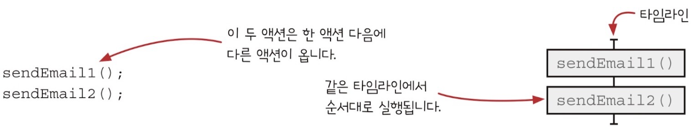
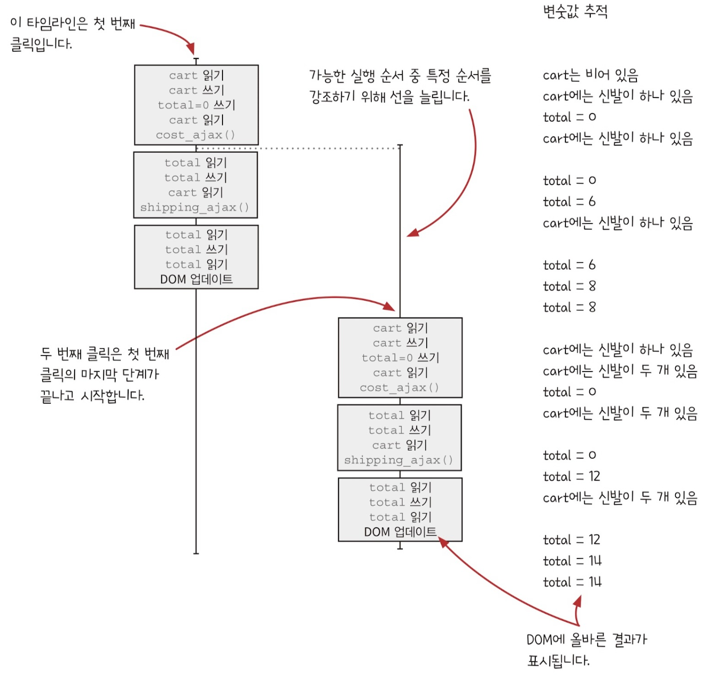

# 타임라인 격리하기

## MegaMart에 버그가 생겼다

제품을 장바구니에 담는 버튼 두 개를 천천히 클릭하면 장바구니 금액이 잘 동작한다. 신발 6달러 + 신발 6달러 + 배송비 2달러 = 14달러

하지만 두 번 빠르게 클릭할 경우 다양한 결과가 나온다.

-   14달러
-   16달러
-   22달러

코드를 확인해보자

```javascript
// 장바구니 추가 버튼을 눌렀을 때 실행되는 함수
function add_item_cart(name, price, quantity) {
    cart = add_item(cart, name, price, quantity);
    calc_cart_total();
}

function calc_cart_total() {
    total = 0;
    // 제품 API로 AJAX요청
    cost_ajax(cart, function () {
        total += cost;
        // 판매 API로 AJAX요청
        shipping_ajax(cart, function (shipping) {
            total += shipping;
            update_total_dom(total);
        });
    });
}
```

위 코드를 유스케이스 다이어그램으로 그리면 아래와 같다.


위 코드와 유스케이스 다이어그램을 봐도 문제가 없는 것처럼 보인다. 실제로 클릭 후 장바구니에 제품이 추가될 때까지 기다리면 정상 작동한다. 그럼 기다리지 않고 버튼을 클릭했을 때 어떤 일이 일어나는지 타임라인 다이어그램으로 확인해보자

## 시간에 따라 어떤 일이 일어나는 지 보여주는 타임라인 다이어그램


타임라인 다이어그램이란 시간에 따른 **액션** 순서를 시각적으로 표시한 것이다. 왼쪽 다이어그램을 보면 잘못된 동작을 하고 있다는 걸 알 수 있다. 우선 타임라인 다이어그램을 그리는 방법부터 알아보자.

## 타임라인 다이어그램 기본 규칙 두 가지

**두 액션이 순서대로 나타나면 같은 타임라인에 넣는다.**



타임라인에는 **액션**만 넣는다. **계산**은 실행 시점에 영향을 받지 않기 때문에 그리지 않는다.

**두 액션이 동시에 실행되거나 순서를 예상할 수 없으면 분리된 타임라인에 넣는다.**


액션이 서로 다른 스레드, 프로세스, 기계, 비동기 콜백에서 실행되면 다른 타임라인에 표시한다. 위 경우는 비동기 콜백에서 실행되는 두 액션을 나타낸 것이다.

## 액션 순서에 관한 주의사항

**++와 +=는 세 단계이다**


만약 `++, +=`이 전역변수의 값을 바꾼다면 이는 읽기(액션), 더하기(계산), 쓰기(액션) 총 세 단계를 거치고 이 중 첫 번째 단계와 마지막 단계는 액션으로 타임라인에 표시해야한다.

**인자는 함수를 부르기 전에 실행한다**


함수가 실행될 때 전달 받는 인자가 전역변수라면 전역변수를 읽는 액션이 가장 먼저 타임라인에 표시해야한다.

## add-to-cart 타임라인 그리기: 단계 1


이렇게 짧은 코드에 액션이 13개 있다. 그리고 비동기 콜백 `shipping_ajax`, `update_total_dom` 두 개가 있다.
여기서 콜백을 어떻게 그리는지 알아보자.

## 비동기 호출은 새로운 타임라인에 그린다.

```javascript
saveUserAjax(user, function () {
    setUserLoadingDOM(false);
});
setUserLoadingDOM(true);
saveDocumentAjax(document, function () {
    setUserLoadingDOM(false);
});
setDocLoadingDOM(true);
```

위 코드는 라인 순서와 다르게 실행될 수 있는 코드다. 이 코드를 타임라인 다이어그램으로 그리면 아래와 같다.


`setUserLoadingDOM(false);`은 각각 `saveUserAjax`, `saveDocumentAjax` 함수의 콜백이므로 서로 다른 다른 타임라인으로 그린다.

## add-to-cart 타임라인 그리기: 단계 2

앞에서 배운 내용으로 타임라인 다이어그램을 그려보자.


이제 타임라인에는 액션 13개가 모두 들어있고 비동기 콜백 두 개 역시 다른 타임라인에 잘 표시되어 있다.

## 타임라인 다이어그램으로 동시에 실행되는 코드는 순서를 예측할 수 없다.

동시에 실행되는 액션은 서로 다른 타임라인에 나란히 표시하는데 이때 이 두 액션이 항상 동시에 실행된다는 의미가 아니다. 이런 액션은 세 가지 실행 순서를 가질 수 있다.


즉 아래 다이어그램 세 개 모두 똑같은 것을 의미한다.


즉 위 다이어그램을 봤을 때 모두 같은 것으로 이해할 수 있어야 한다.

## 좋은 타임라인 원칙

-   타임라인은 적을수록 이해하기 쉽다.
-   타임라인은 짧을수록 이해하기 쉽다.
-   공유하는 자원이 적을수록 이해하기 쉽다.
-   자원을 공유한다면 서로 조율해야 한다.
-   시간을 일급으로 다룬다.

## 타임라인 단순화 하기

자바스크립트는 단일 스레드 모델을 사용하므로 같은 타임라인에 있는 액션은 상자 하나로 묶을 수 있다.


이건 좀 전에 봤던 타임라인이다. 만약 자바스크립트를 사용한다면 타임라인 하나를 묶을 수 있다.


이렇게 완성된 타임라인 다이어그램으로 가능한 액션 순서를 알 수 있다. 또한 순서를 이해하면 코드가 제대로 동작하는지도 알 수 있다. 여기서 순서는 두 종류의 순서가 있다. 확실하거나 불확실하거나.

먼저 왼쪽에 있는 액션은 같은 타임라인에서 실행되므로 액션이 순서대로 실행된다는 것을 알 수 있다. 그리고 그 끝에는 점선이 있기 때문에 다른 타임라인이 실행되기 전에 끝난다는 것도 알 수 있다.

나머지 중간, 오른쪽 타임라인은 동시, 왼쪽 먼저, 오른쪽 먼저 즉 세 가지 순서로 실행될 수 있다. 다만 자바스크립트에서는 스레드 하나에서 실행하기 때문에 실제로는 둘 중 하나가 먼저 실행되게 된다. 그러나 이 타임라인의 경우에는 순서대로 로딩을 표시하고 콜백에서 로딩을 감추기 때문에 어느 것이 먼저 실행되도 문제가 없다.

## add-to-cart 타임라인 단순화하기: 단계 3


앞에서 본 타임라인 그리기 2단계다. 여기서 타임라인을 단순화할 건데 만약 타임라인 끝에 다른 타임라인이 온다면, 즉 타임라인간에 순서가 섞일 일이 없다면 하나로 묶을 수 있다.


## 두 번 클릭했을 때 생기는 문제

**두 번 천천히 클릭했을 때**



천천히 클릭했을 경우에는 첫 번째 클릭의 마지막 단계가 끝나고 나서 두 번째 클릭이 시작된다. 따라서 의도된 대로 작동한다.

**두 번 빠르게 클릭했을 때**


여기서 문제가 생긴다. 어느 시점에 클릭 핸들러가 실행되는지에 따라서 액션에 순서가 달라진다. 각 단계가 섞이는 것이다. 이 경우 클릭 시점에 따라서 실행 가능한 순서가 10개나 된다. 코드가 잘 동작한다는 걸 어떻게 보장할 수 있을까?

## 자원을 공유하는 타임라인은 문제가 된다.

```javascript
function add_item_cart(name, price, quantity) {
    // 전역 변수 cart를 참조
    cart = add_item(cart, name, price, quantity);
    calc_cart_total();
}

function calc_cart_total() {
    // 전역 변수 total을 참조
    total = 0;
    cost_ajax(cart, function () {
        total += cost;
        shipping_ajax(cart, function (shipping) {
            total += shipping;
            update_total_dom(total);
        });
    });
}
```

클릭을 여러 번 했을 경우 클릭 횟수와 동일한 타임라인이 생기게 되는데 이때 모든 타임라인은 전역변수 `total, cart` 그리고 `DOM`을 공유한다. 특히 지금 해결하고 있는 버그는 `total` 전역 변수를 공유해서 그런 것이다.

### 전역변수를 지역변수로 바꾸기

```javascript
function calc_cart_total() {
    // 전역변수 total을 지역변수로 바꿨다.
    let total = 0;
    cost_ajax(cart, function () {
        total += cost;
        shipping_ajax(cart, function (shipping) {
            total += shipping;
            update_total_dom(total);
        });
    });
}
```

`calc_cart_total`함수에서 참조하는 전역변수 `total`을 지역변수로 바꿨다. 따라서 total을 참조하는 부분이 모두 계산으로 바뀌었으므로 타임라인도 더 단순해질 수 있다. 이어서 전역변수 `cart`를 없애보자

### 전역변수를 인자로 바꾸기

```javascript
function add_item_cart(name, price, quantity) {
    cart = add_item(cart, name, price, quantity);
    // cart를 인자로 전달
    calc_cart_total(cart);
}

// 전달받은 인자 cart 사용
function calc_cart_total(cart) {
    let total = 0;
    cost_ajax(cart, function () {
        total += cost;
        shipping_ajax(cart, function (shipping) {
            total += shipping;
            update_total_dom(total);
        });
    });
}
```

전역변수 `cart`를 인자로 받게 코드를 바꿔서 타임라인끼리 공유하는 자원을 줄였다.


이렇게 공유하는 자원을 줄이고 액션을 줄여 타임라인을 단순화시킬 수 있다.
