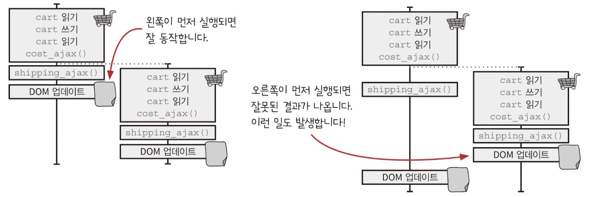

# 타임라인 사이에 자원 공유하기

이전 챕터에서 타임라인을 그리고 코드를 수정하고 공유하는 자원을 없애면서 개선했지만 여전히 장바구니에는 버그가 남아있다. 여전히 DOM을 공유하고 있기 때문이다.

처음 실행된 타임라인의 DOM업데이트가 실행된 뒤 두 번째 타임라인의 DOM업데이트가 이루어지는 것이 기대했던 결과이지만 이 순서가 바뀐다면 DOM에 업데이트되는 장바구니 금액에 오류가 생기게 된다.



이런 문제를 해결하려면 DOM이 업데이트 되는 순서를 보장해야한다. 이를 위해 큐 자료구조를 사용할 수 있다.

## 자바스크립트에서 큐 만들기

자바스크립트에는 큐 자료 구조가 없기 때문에 직접 만들어야 한다. 우선 클릭 핸들러에서 처리할 일과 큐에서 처리할 일을 나눠보자.

최대한 많은 일을 클릭 핸들러에서 하는 것이 좋다. 클릭 핸들러에는 다른 작업이 끼어들 수 없기 때문에 순서가 섞일 수 없기 때문이다.


이렇게 처리할 일을 나누면 위 같은 모습이 된다. 큐에서 처리할 작업을 큐에 넣는 액션 하나로 바꾸자.

```javascript
function add_item_cart(item) {
    cart = add_item(cart, item);
    update_total_queue(cart);
}

function calc_cart_total(cart, callback) {
    let total = 0;
    cost_ajax(cart, function () {
        total += cost;
        shipping_ajax(cart, function (shipping) {
            total += shipping;
            update_total_dom(total);
        });
    });
}

function Queue() {
    const queue_items = [];
    let working = false;

    function runNext() {
        if (working) return;
        if (queue_items.length === 0) return;
        working = true;
        const cart = queue_items.shift();
        calc_cart_total(cart, function () {
            update_total_dom(total);
            working = false;
            runNext();
        });
    }

    return function (cart) {
        queue_items.push(cart);
        setTimeout(runNext, 0);
    };
}

const update_total_queue = Queue();
```

위 코드는 `Queue`함수로 `queue_items`라는 큐 배열에 `cart`정보를 담고 순서대로 DOM 업데이트하는 함수를 `update_total_queue`함수를 만들었다. 그리고 동시에 싫행되는 것을 방지하기 위해 `working`이라는 플래그를 만들었다.


이제 클릭 핸들러는 서로 순서가 섞일 수 없게 되었고 DOM을 업데이트하는 큐도 하나의 타임라인으로 순서대로 업데이트 되도록 만들었다.

## 큐를 재사용할 수 있도록 만들기

이번에 만든 큐 코드는 잘 만들어졌지만 장바구니에 제품을 추가하는 것에 특화된 코드다. 재사용할 수 있게 만들기 위해 함수 본문을 콜백으로 바꾸기 리팩터링으로 큐를 반복해서 처리하는 코드와 큐에서 하는 일을 분리하자.

```javascript
// 큐에서 실행할 함수를 인자 worker로 받는다.
function Queue(worker) {
    const queue_items = [];
    let working = false;

    function runNext() {
        if (working) return;
        if (queue_items.length === 0) return;
        working = true;
        const item = queue_items.shift();

        worker(item.data, function (val) {
            working = false;
            // 콜백 작업 실행
            setTimeout(item.callback, 0, val);
            runNext();
        });
    }

    return function (data, callback) {
        // 콜백 실행에 필요한 data, callback을 큐에 삽입
        queue_items.push({
            data: data,
            callback: callback || function () {},
        });
        setTimeout(runNext, 0);
    };
}

function calc_cart_worker(cart, done) {
    calc_cart_total(cart, function (total) {
        update_total_dom(total);
        done(total);
    });
}

// 큐에서 실행될 worker 전달
const update_total_queue = Queue(calc_cart_worker);
```

이제 큐는 재사용하기 좋게 만들어졌다. 큐를 거치는 모든 작업을 처리하고 작업이 완료되면 타임라인이 이어서 작업을 계속한다. 그러나 이렇게 만든 큐에는 문제가 있다.

## 큐를 건너뛰도록 만들기

구현한 큐에서 워커는 모든 작업이 끝나야 다음 작업으로 넘어갈 수 있다. 만약 누군가 장바구니에 제품을 추가하는 버튼을 네 번 아주 빠르게 클릭한다고 해보자. DOM에 표시되는 장바구니 금액은 최종 결과만 보여주면 된다. 하지만 지금 만든 코드는 모든 클릭에 대한 결과를 DOM에 순서대로 업데이트하고 있다. 따라서 매우 느리다. 이 문제를 해결해보자.

```javascript
// 보관할 수 있는 최대 큐 크기를 max로 받는다.
function DroppingQueue(max, worker) {
    const queue_items = [];
    let working = false;

    function runNext() {
        if (working) return;
        if (queue_items.length === 0) return;
        working = true;
        const item = queue_items.shift();

        worker(item.data, function (val) {
            working = false;
            setTimeout(item.callback, 0, val);
            runNext();
        });
    }

    return function (data, callback) {
        queue_items.push({
            data: data,
            callback: callback || function () {},
        });

        // 주어진 max보다 큐 길이가 길면 모두 잘라낸다.
        while (queue_items.length > max) {
            queue_items.shift();
        }
        setTimeout(runNext, 0);
    };
}

function calc_cart_worker(cart, done) {
    calc_cart_total(cart, function (total) {
        update_total_dom(total);
        done(total);
    });
}

const update_total_queue = Queue(1, calc_cart_worker);
```

위에서 새로 만든 `DroppingQueue` 함수는 사용하면 몇 번을 클릭하던 큐 항목이 최대 한 개 이상 늘어나지 않는다. 사용자는 클릭에 대한 모든 작업이 끝날 때까지 기다릴 필요 없이 최대 두 번의 작업만 기다리면 된다.
