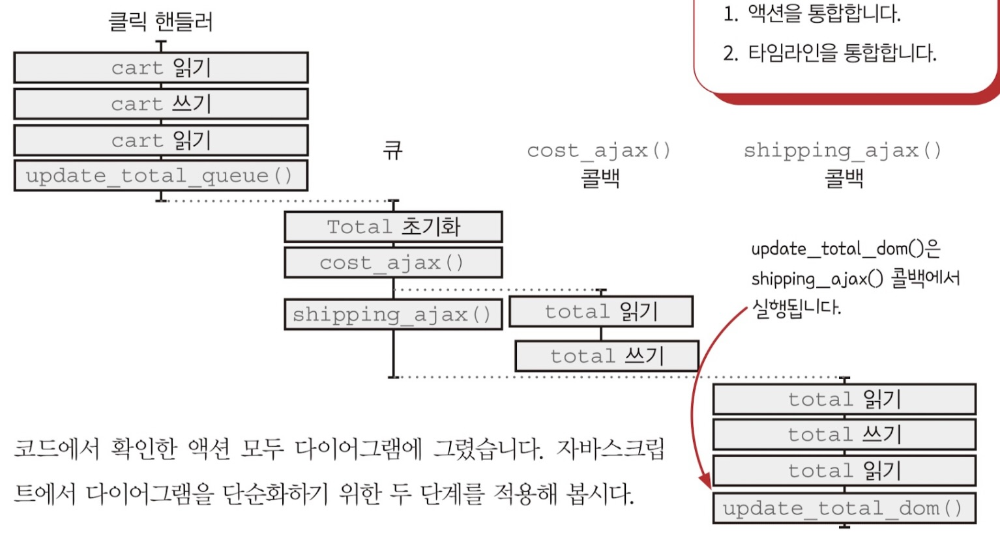
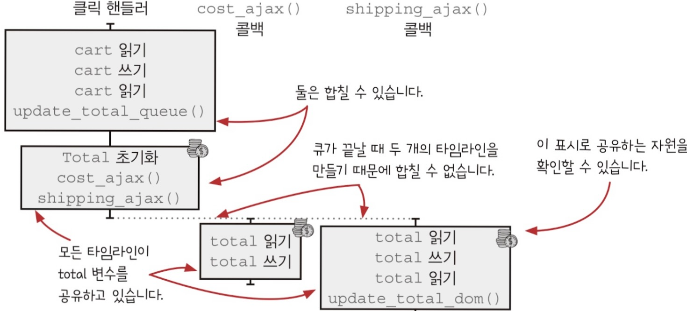
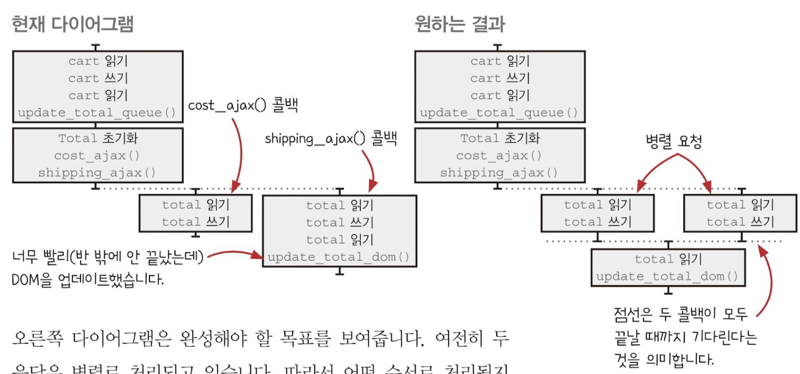
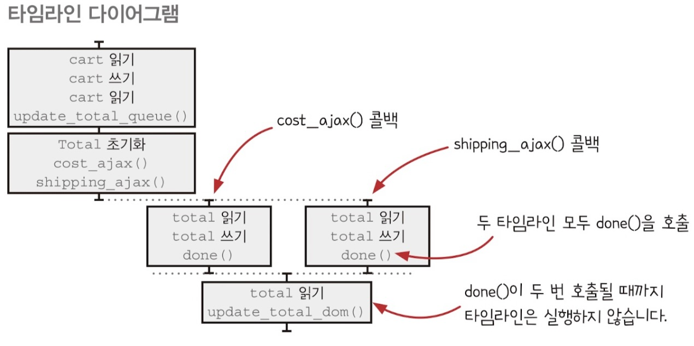

# 타임라인 조율하기

이전 챕터에서 자원을 안전하게 공유하기 위해 큐를 만들고 재사용 가능한 함수로 만들면서 개선했다. 그런데 문제가 하나 생겼다.

## 버그가 있습니다!

장바구니에 큐를 적용해서 열심히 기능을 만들어 놨는데 속도를 개선해달라는 요청 때문에 코드를 수정했다. 그러자 새로운 버그가 생겼다.

이번에는 제품을 하나만 추가해도 잘못된 장바구니 금액이 표시된다.

```javascript
// 속도를 개선한 코드
function add_item_to_cart(item) {
    cart = add_item(cart, item);
    update_total_queue(cart);
}

function calc_cart_total(cart, callback) {
    let total = 0;
    cost_ajax(cart, function (cost) {
        total += cost;
        // 이 부분에서 괄호가 닫힌다.
    });

    shipping_ajax(cart, function (shipping) {
        total += shipping;
        callback(total);
    });
}

function calc_cart_worker(cart, done) {
    calc_cart_total(cart, function (total) {
        update_total_dom(total);
        done(total);
    });
}

const update_total_queue = DroppingQueue(1, calc_cart_worker);
```

위 코드에서 `cost_ajax`함수를 호출하는 부분의 괄호가 옮겨졌다. 이전에는 `cost_ajax`함수의 콜백 안에 `shipping_ajax`가 있었다.  
때문에 `cost_ajax`함수와 `shipping_ajax`함수가 거의 동시에 실행된다. 여기서 버그가 생기는 것

### 액션 확인하기

위 코드에서 액션은 모두 13개로 아래와 같다.

1. cart 읽기
2. cart 쓰기
3. cart 읽기
4. update_total_queue() 부르기
5. total = 0 초기화
6. cost_ajax() 부르기
7. total 읽기
8. total 쓰기
9. shipping_ajax() 부르기
10. total 읽기
11. total 쓰기
12. total 읽기
13. update_total_dom() 부르기

### 액션 그리기

모든 액션을 타임라인으로 그리면 아래와 같다.



### 타임라인 최적화

자바스크립트는 단일 스레드를 사용하기 때문에 하나의 타임라인에 있는 모든 액션을 하나로 통합하고 타임라인이 끝나는 지점에서 새로운 타임라인이 있다면 그 둘을 통합하여 타임라인을 단순화 한다.



## 실행 가능한 순서 분석하기

위에서 본 타임라인에서 중간, 오른쪽 타임라인은 둘 중 어느게 먼저 실행될 지 보장할 수 없다 만약 오른쪽 타임라인이 먼저 실행된다면 `cost_ajax` 응답을 받기 전에 DOM이 업데이트 되므로 버그가 생기게 될 것이다.

## 버그가 있는 타임라인이 더 빠르다

지금 타임라인은 `cost_ajax`, `shipping_ajax`가 병렬로 처리된다. 이전에는 `cost_ajax`작업이 끝나야 `shipping_ajax`작업이 시작됐다. 따라서 버그가 있지만 지금 타임라인이 더 빠른 것이다. 지금처럼 병렬로 응답을 기다리면서 속도를 개선하고 버그도 수정할 수 있는 방법이 있을까?

## 모든 병렬 콜백 기다리기

빠른 속도를 유지하면서 버그를 해결하려면 ajax 응답을 모두 기다렸다가 DOM을 업데이트하면 된다.



왼쪽이 속도 개선 후 버그가 생긴 다이어그램, 오른쪽이 속도, 버그를 다 잡은 다이어그램이다. 다이어그램에 있는 점선을 **컷**이라고 하는데 이 컷을 만들면 컷을 기준으로 앞부분과 뒷부분이 나뉘게 된다. 그리고 이 둘은 서로 섞이지 않기 때문에 타임라인 각각을 분석할 수 있다. 즉 복잡성이 줄어든다.

## 타임라인을 나누기 위한 동시성 기본형

여러 타임라인이 서로 다른 시간에 종료되어도 서로 기다릴 수 있는 재사용 가능한 기본형이 필요하다. 이를 구현해보겠다.

```javascript
// num: 기다릴 타임라인 수
// callback: 모든 것이 끝났을 때 실행할 콜백
function Cut(num, callback) {
    let num_finished = 0;
    return function () {
        num_finished += 1;
        if (num_finished === num) callback();
    };
}

// done 함수가 세 번 호출되면 콜백 실행
const done = Cut(3, function () {
    console.log("3 timelines are finished");
});

done();
done();
done();

// "3 timelines are finished"
```

여기서 만든 `Cut`이 리턴하는 함수를 타임라인이 끝날 때 부르게 된다면 의도한 타임라인의 작업이 모두 끝나는 타이밍을 알 수 있고 그때 콜백을 실행시킬 수 있다.

## 코드에 Cut 적용하기

새로 만든 `Cut`을 장바구니 코드에 추가해보자. 두 가지를 고려해야 한다.

-   **`Cut`을 보관할 범위**  
    응답 콜백 끝에서 `done`을 불러야 하기 때문에 두 응답 콜백을 만드는 `calc_cart_total`함수 안이 좋겠다.
-   **`Cut`에 어떤 콜백을 넣을지**  
     `calc_cart_total`함수 안에는 이미 `total` 계산이 끝났을 때 부르는 콜백이 있다. `calc_cart_total`함수의 콜백을 받아서 사용하자

```javascript
function calc_cart_total(cart, callback) {
    let total = 0;
    const done = Cut(2, function () {
        callback(total);
    });

    cost_ajax(cart, function (cost) {
        total += cost;
        done();
    });

    shipping_ajax(cart, function (shipping) {
        total += shipping;
        done();
    });
}
```

위는 `Cut`을 적용한 코드다. 타임라인 다이어그램을 확인해보자.



이제 `cost_ajax`콜백과 `shipping_ajax`콜백은 여전히 병렬로 처리되며 빠른 속도를 유지하고 있고 `Cut`을 사용하여 모든 타임라인에서 `done`을 호출할때까지 기다린 후 콜백으로 `update_total_dom`을 호출하게 했다.

이제는 `cost_ajax`, `shipping_ajax` 둘 중 어떤 것이 빠르게 응답하는지 상관 없이 정상적으로 작동한다.

## 새로운 기능 요청

누군가가 장바구니에 제품을 처음 추가했을 때 메시지를 보내는 기능을 만들어야 한다.

```javascript
// 함수를 호출하면 메시지가 전달된다.
function sendAddToCartText(number) {
    sendTextAjax(number, "Thanks for adding something to your cart.");
}

// action: 액션을 전달
function JustOnce(action) {
    // 함수가 호출된 적 있는 지 확인
    let alreadyCalled = false;
    return function (a, b, c) {
        // 실행한 적이 있으면 종료
        if (alreadyCalled) return;
        // 실행을 기록한 후 액션 호출
        alreadyCalled = true;
        return action(a, b, c);
    };
}

const sendAddToCartTextOnce = JustOnce(sendAddToCartText);

// 여러번 실행해도 최초 한 번만 실행된다.
sendAddToCartTextOnce("555-555-5555-55");
sendAddToCartTextOnce("555-555-5555-55");
sendAddToCartTextOnce("555-555-5555-55");
```
