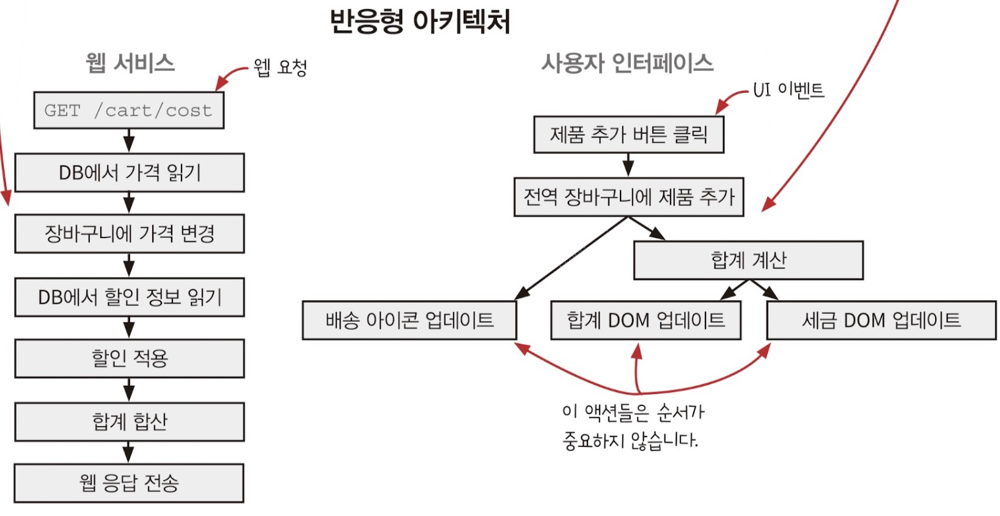

# 반응형 아키텍처와 어니언 아키텍처

## 반응형 아키텍처



반응형 아키텍처는 코드에 나타난 순차적 액션의 순서를 뒤집는다. 가령 X를 하고 Y를 하는 대신에 X가 일어나면 언제나 Y를 한다. 이렇게 하면 코드를 읽기 쉽고 유지보수하기도 좋다.

이를 장바구니에 적용해보자.

### 셀은 일급 상태입니다.

장바구니는 전역변수이고 언제 바뀔지 모른다. 아래는 변경 가능한 값을 일급 함수로 만드는 코드다.

```javascript
function ValueCell(initalValue) {
    let currentValue = initalValue;
    return {
        val: function () {
            return value;
        },
        update: function (f) {
            const oldValue = currentValue;
            const newValue = f(oldValue);
            currentValue = newValue;
        },
    };
}
```

위 `ValueCell`에는 값 하나와 두 개의 동작이 있다.

-   `val`: 값을 읽는 동작
-   `update`: 값을 바꾸는 동작

이것을 장바구니에 적용해보자

```javascript
const shopping_cart = ValueCell({});

function add_item_to_cart(name, price) {
    // 값을 변경하기 위해 값을 직접 할당하지 않고 메서드를 호출한다.
    shopping_cart.update(function (cart) {
        return add_item(cart, item);
    });

    // 값을 읽을 때도 마찬가지로 메서드를 호출한다.
    const total = calc_total(shopping_cart.val());
    set_cart_total_dom(total);
    update_shipping_icons(shopping_cart.val());
    update_tax_dom(total);
}
```

이제 `ValueCell` 함수를 적용해서 값을 읽고 쓰는 코드를 명확한 메서드로 바꿨다.

### ValueCell을 반응형으로 만들기

값을 읽고 쓸 때 메서드를 쓰도록 바꿨다. 이제 값, 즉 상태가 바뀔 때 X를 하도록 만들어보자.

```javascript
function ValueCell(initalValue) {
    let currentValue = initalValue;
    const watchers = [];
    return {
        val: function () {
            return value;
        },
        update: function (f) {
            const oldValue = currentValue;
            const newValue = f(oldValue);
            // 상태가 바뀔 때 지정된 일을 수행하도록 감시자(옵저버, 리스너 등으로도 불림)를 설정한다.
            if (oldValue !== newValue) {
                currentValue = newValue;
                forEach(watchers, function (watcher) {
                    watcher(newValue);
                });
            }
        },
        // 상태가 바뀔 때 수행할 작업을 등록한다.
        addWatcher: function (f) {
            watchers.push(f);
        },
    };
}
```

이제 상태가 바뀔 때 수행할 작업을 지정할 수 있게 됐다. 이것을 코드에 장바구니 코드에 적용해보자

### 셀이 바뀔 때 배송 아이콘 갱신

```javascript
const shopping_cart = ValueCell({});

function add_item_to_cart(name, price) {
    shopping_cart.update(function (cart) {
        return add_item(cart, item);
    });

    const total = calc_total(shopping_cart.val());
    set_cart_total_dom(total);
    // 여기에 있던 아이콘 갱신 함수를
    // update_shipping_icons(shopping_cart.val());
    update_tax_dom(total);
}

// 이쪽으로 옮긴다.
shopping_cart.addWatcher(update_shipping_icons);
```

자 이제는 장바구니 값이 바뀌면 배송 아이콘을 갱신하는 함수가 같이 실행될 것이다. 코드를 이렇게 바꾸면 핸들러 함수 `add_item_to_cart`가 더 작아지고 배송 아이콘은 항상 최신 장바구니 상태를 반영할 것이다. 이 말은 즉, 장바구니 물품 삭제, 추가, 수량 변경에 따로 처리를 할 필요가 없다는 것이다!

`add_item_to_cart`함수에서 DOM을 갱신하는 작업 하나를 밖으로 빼냈다. DOM을 업데이트하는 작업 `set_cart_total_dom`, `update_tax_dom`도 마저 빼보자

### 파생된 값을 계산하는 FormulaCell

```javascript
function FormulaCell(upstreamCell, f) {
    const myCell = ValueCell(f(upstreamCell.val()));
    // 이미 있는 상태가 변경되면 파생된 상태도 변경하도록 감시자 추가
    upstreamCell.addWatcher(function (newUpstreamValue) {
        myCell.update(function (currentValue) {
            return f(newUpstreamValue);
        });
    });
    return {
        val: myCell.val,
        addWatcher: myCell.addWatcher,
    };
}
```

> 🧐 와 이건 좀 멋있는데

`FormulaCell`는 *장바구니 값에서 파생된 세금 등*처럼 이미 있는 셀에서 파생한 셀을 만들 수 있다. 이때 파생된 값은 직접 바꿀 수 없으며 상위 셀이 바뀔 때 같이 바뀐다. 이를 응용해보자

```javascript
const shopping_cart = ValueCell({});
const cart_total = FormylaCell(shopping_cart, calc_total);

function add_item_to_cart(name, price) {
    shopping_cart.update(function (cart) {
        return add_item(cart, item);
    });

    const total = calc_total(shopping_cart.val());
    // 여기 있던 DOM 갱신 함수를
    // set_cart_total_dom(total);
    // update_tax_dom(total);
}

shopping_cart.addWatcher(update_shipping_icons);
// 이쪽으로 옮긴다.
cart_total.addWatcher(set_cart_total_dom);
cart_total.addWatcher(update_tax_dom);
```

자, 이제 장바구니 값이 바뀔 때마다 장바구니 총 금액 값도 바뀌게 되고 그에 따른 DOM 업데이트를 감시자로 추가해서 앞에서 말했던 X가 일어나면 Y를 한다를 만들었다!

> 리덕스 리코일이 이와 같은 형태를 쓴다... 멋있다...

## 어니언 아키텍처

...? 이해가 안된다.
