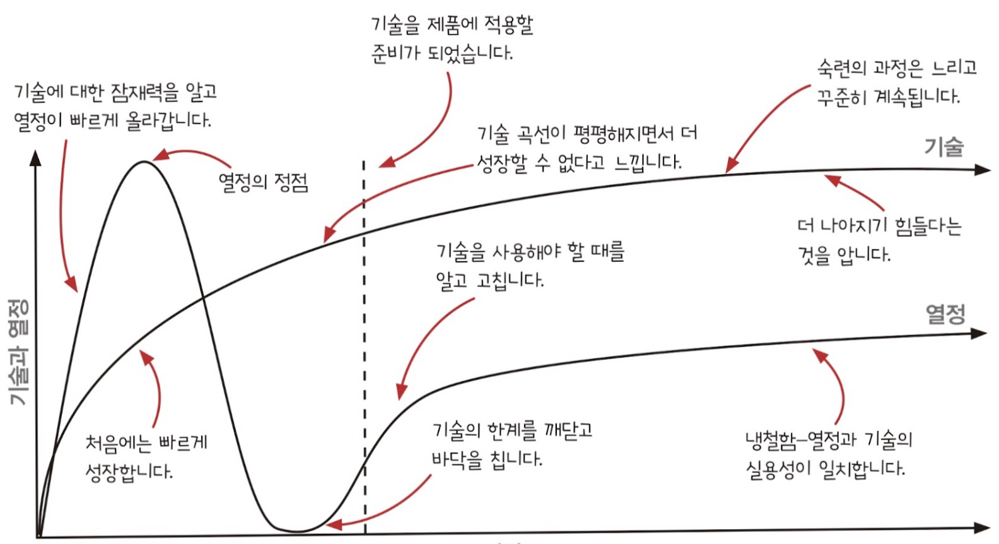
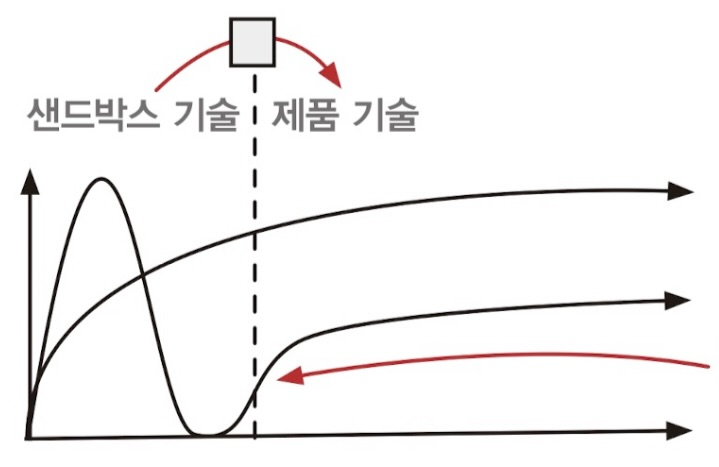

# 함수형 프로그래밍 여행에 앞서

## 이 책에서 배운 기술

### 파트 1: 액션과 계산, 데이터

-   코드에서 액션과 계산, 데이터를 구분하고 문제가 되는 부분을 찾는다.
-   액션에서 계산을 빼내 재사용하기 좋고 테스트하기 쉬운 코드를 만든다.
-   암묵적인 입력과 출력을 명시적인 것으로 바꿔 액션의 설계를 개선한다.
-   불변성을 구현해 데이터 읽기를 계산으로 만든다.
-   개층형 설계로 코드를 구성하고 개선한다.

### 파트 2: 일급 추상

-   언어의 문법을 일급으로 만들어 코드를 추상화한다.
-   함수형 반복과 함수형 도구를 사용해 고차원으로 추론한다.
-   함수형 도구를 연결해 데이터 변환 파이프라인을 만든다.
-   타임라인 다이어그램을 통해 동시성 분산 시스템을 이해한다.
-   버그를 없애기 위해 타임라인을 활용한다.
-   고차 함수로 안전하게 상태를 변경한다.
-   반응형 아키텍처를 사용해 원인과 효과의 결합을 줄인다.
-   세상과 상호작용하기 위해 어니언 아키텍처 설계를 서비스에 적용한다.

## 투 트랙으로 마스터가 되기

위 그래프를 보면 알 수 있듯이 새로운 기술을 배우면 기쁘고 적용해보고 싶은 마음에 열정이 넘친다. 하지만 곧 한계를 배우면서 열정이 바닥을 친다. 그 이후 기술을 사용해야 할 때를 알고 사용하지 말아야 할 대를 알게 되면서 숙달된다. 이 과정에서 숙달되지 않았지만 과도하게 새로운 기술을 적용하려고 하는 때이다. 이런 문제를 어떻게 극복할 수 있을까?

숙달되지 않은 상태에서 어설픈 코드를 제품에 적용하는 위험을 감수하기는 어려울 것이다. 따라서 기술에 익숙해지기까지 사이드 프로젝트 등을 통해 숙련도를 올리고 어느정도 숙련도가 올라왔다면 실제 프로젝트에 적용해볼 수 있다.

-   샌드박스
    -   연습 문제로 연습
    -   사이드 프로젝트
    -   제품 코드에서 버려진 브랜치
-   제품
    -   이미 있는 코드를 리팩터링
    -   이미 있는 프로젝트에 새로운 기능
    -   새로 만드는 깨끗한 제품
    -   다른 사람들을 가르치기

> 🤔 사실 내 경우를 보면 제품에 적용할 수 있는 기회는 당장은 없다고 봐야지

-   **샌드박스**
    -   처음에는 작은 프로젝트로 시작
    -   재미로 하는 사이드 프로젝트
    -   익숙한 기술과 새 기술을 함께 사용  
         새 기술 + 새 기술을 습득하는 것은 힘들다.
    -   언제든지 기능을 추가해 볼 수 있는 프로젝트 준비  
        내 경우에는 포트폴리오 사이트가 적당하겠다.
-   **제품**
    -   버그를 없애보자
    -   설계를 하나씩 개선하자

## 수학적 지식 얻기

-   람다 대수
-   콤비네이터
-   타입 이론
-   카테고리 이론
-   이펙트 시스템
